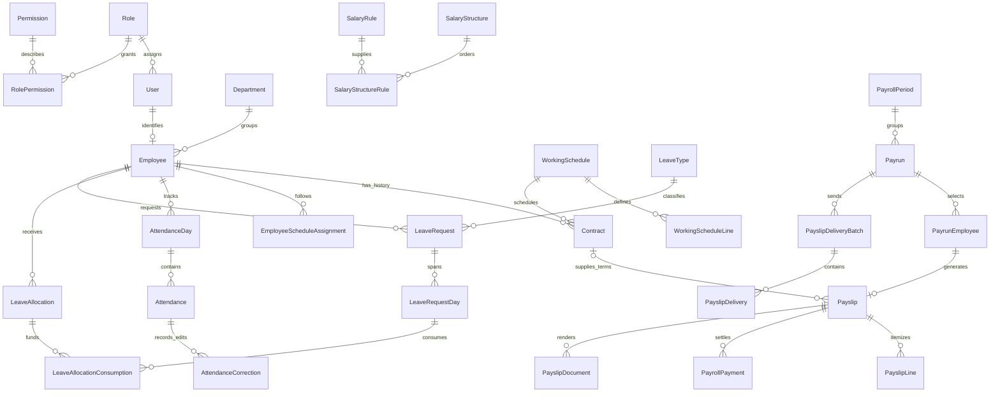

# PeoplePay360 schema guide

The data model is in [prisma/schema.prisma](prisma/schema.prisma). It contains **44 models and 38 enums** organized into **six PostgreSQL schemas**, built for this project's installed **Prisma 7.10.0 and PostgreSQL**.

Source: the supplied 11-page **PeoplePay360 HR & Payroll.pdf**. The PDF was treated as the product specification, not as instructions to deploy software or perform external actions.

This deliverable implements the database representation of the requested features. API authorization, calculations, approval transactions, UI views, PDF rendering, email workers and dashboard queries still need application code. Database enums describe states; they do not enforce valid transitions.

## PostgreSQL namespace layout

All six namespaces live inside the same PostgreSQL database. Set DATABASE_URL's database path to Odoo_hackathon when that is the intended database; the schema file does not create or rename the database. Use ?schema=auth as the Prisma connection default. The runtime PostgreSQL adapter also uses auth, and the local Odoo_hackathon database has search_path set to auth. The public schema has been removed from that database.

```prisma
datasource db {
  provider = "postgresql"
  schemas  = ["auth", "hr", "attendance", "leave", "payroll", "configuration"]
}
```

Every model and enum declares its owning namespace through @@schema. Related models may reside in different namespaces; Prisma's normal relation API remains available. See [Prisma multi-schema documentation](https://docs.prisma.io/docs/orm/v6/prisma-schema/data-model/multi-schema).

| PostgreSQL schema | Tables | Enum types |
| --- | --- | --- |
| auth | `User`, `Role`, `Permission`, `RolePermission`, `AuditLog` | `UserRole`, `PermissionAction`, `AccessScope` |
| hr | `Employee`, `Department`, `JobPosition`, `Contract`, `EmploymentHistory`, `EmployeeBankAccount`, `EmployeeScheduleAssignment` | `EmployeeStatus`, `EmployeeType`, `EmploymentEventType`, `ContractStatus`, `WageBasis` |
| attendance | `Attendance`, `AttendanceDay`, `AttendanceCorrection`, `AttendanceException` | `AttendanceStatus`, `AttendanceSource`, `AttendanceExceptionType`, `ExceptionStatus` |
| leave | `LeaveType`, `LeaveAllocation`, `LeaveAllocationApproval`, `LeaveRequest`, `LeaveRequestDay`, `LeaveRequestApproval`, `LeaveAllocationConsumption` | `LeaveUnit`, `ApprovalPolicy`, `AllocationApprovalPolicy`, `ApprovalStatus`, `LeavePayrollTreatment`, `LeaveStatus`, `AllocationKind` |
| payroll | `PayrollPeriod`, `Payrun`, `PayrunEmployee`, `Payslip`, `PayslipLine`, `PayslipWorkedTime`, `PayslipInput`, `PayrollPayment`, `PayrollWarning`, `PayslipDocument`, `PayslipDeliveryBatch`, `PayslipDelivery`, `PayslipDeliveryAttempt` | `PayrunStatus`, `PayrunEmployeeStatus`, `PayslipStatus`, `WorkedTimeType`, `WarningCode`, `WarningSeverity`, `WarningStatus`, `PaymentStatus`, `PaymentMethod`, `DocumentStatus`, `DeliveryStatus`, `DeliveryBatchStatus` |
| configuration | `WorkingSchedule`, `ScheduleLine`, `ScheduleHoliday`, `SalaryStructure`, `SalaryRule`, `SalaryRuleCategory`, `SalaryStructureRule`, `SalaryRuleDependency` | `ScheduleType`, `Weekday`, `SalaryCategoryType`, `SalaryComputationMethod`, `SalaryConditionMethod`, `SalaryRuleEffect`, `PayFrequency` |

There are **44 tables and 38 enum types** across these six namespaces. EmployeeScheduleAssignment belongs to hr because it records employee-specific history; reusable schedule definitions belong to configuration. PDF and email delivery tables belong to payroll. Shared enums have one owner: for example, configuration.PayFrequency is also used by hr.Contract and payroll.PayrollPeriod.

The database table configuration.ScheduleLine maps to the existing Prisma model WorkingScheduleLine via @@map("ScheduleLine"). Existing client calls such as prisma.workingScheduleLine continue to use that model name.

auth.Role is a real table whose primary key is the existing UserRole enum code. User.role and RolePermission.role reference Role.code, preserving existing role values and login payloads. Seed the seven canonical/legacy rows using [prisma/seed-roles.sql](prisma/seed-roles.sql) after creating the role table and before creating users or enforcing the new foreign keys against existing users. This seed provides role definitions; it does not grant permissions.

## Requirement coverage

| Statement section | Requirement | Models / representation |
| --- | --- | --- |
| 3 | Five roles; administrator manages users and permissions | User, Role, Permission, RolePermission; UserRole, PermissionAction, AccessScope |
| A1, B1, B2 | Employee identity, department, position, manager, status; related record counts | Employee, Department, JobPosition; Employee self relation; relation counts |
| A1, overview | Salary banking details and employee history | EmployeeBankAccount, EmploymentHistory, Contract |
| A2 | Contracts, historical wages/terms, applicable dates and structure | Contract with inclusive dates, wage basis, currency, status, schedule and structure |
| A3 | Weekly schedule lines, breaks, weekly hours, employee/contract assignment | WorkingSchedule, WorkingScheduleLine, EmployeeScheduleAssignment, ScheduleHoliday |
| A4, B4 | Leave policies, units, workflows and payroll treatment | LeaveType; snapshots in LeaveRequest and LeaveAllocation |
| A4 | Allocation approval, validity, taken/remaining balances | LeaveAllocation, LeaveAllocationApproval, LeaveAllocationConsumption |
| B4 | Requests, partial-day/hourly duration, approval/refusal/cancellation | LeaveRequest, LeaveRequestDay, LeaveRequestApproval |
| A5 | Salary structures, ordered rules, active status and counts | SalaryStructure, SalaryStructureRule; counts over rules/contracts |
| A6 | Basic, allowances, gross, deductions, contributions and net; fixed/percentage/formula calculation | SalaryRuleCategory, SalaryRule, SalaryRuleDependency |
| B3 | Check-in/out, worked hours, exceptions, manual corrections | AttendanceDay, Attendance, AttendanceException, AttendanceCorrection |
| B5 | Two-step wizard and explicit employee selection | PayrollPeriod, Payrun, PayrunEmployee; no database insert at Continue |
| B6 | Compute, validate, mark paid, warnings and payroll history | Payrun, Payslip, PayrollWarning, PayrollPayment; state/timestamp/version fields |
| B7 | Period contract, salary breakdown, worked days and variable inputs | Payslip, PayslipLine, PayslipWorkedTime, PayslipInput; frozen snapshots |
| B8 | Individual PDF printing and bulk email delivery | PayslipDocument, PayslipDeliveryBatch, PayslipDelivery, PayslipDeliveryAttempt |
| A7, B9 | Live KPIs, department costs, salary trends, attendance/leave overviews and alerts | Aggregations over operational tables, with period/department/type indexes |
| Overview, 5 | Auditable connected workflow and historical record retention | Foreign keys, Restrict deletion, EmploymentHistory, AttendanceCorrection, AuditLog |

Kanban/list/form views, navigation, smart buttons and the wizard are UI behavior over these relations. They do not need separate tables. Dashboard values are derived from actual data; there is deliberately no table of hardcoded dashboard totals.

## Model directory

| Area | Models and purpose |
| --- | --- |
| Identity (4) | **User**: existing login plus role/activity and optional employee link. **Role**: role catalog keyed by UserRole code. **Permission**: resource/action catalog. **RolePermission**: permission grant for a role, with OWN or ALL scope. |
| Employee master (6) | **Department**: hierarchy. **JobPosition**: position catalog. **Employee**: central profile and management hierarchy. **EmployeeBankAccount**: encrypted bank identifiers. **EmploymentHistory**: effective-dated changes. **Contract**: historical employment and wage terms. |
| Schedule and attendance (8) | **WorkingSchedule**: schedule configuration. **WorkingScheduleLine**: daily shift intervals. **ScheduleHoliday**: exceptions to the week. **EmployeeScheduleAssignment**: assignment history. **AttendanceDay**: daily reporting rollup. **Attendance**: actual sessions. **AttendanceCorrection**: old/new timestamps and authorized editor. **AttendanceException**: issue and resolution. |
| Leave (7) | **LeaveType**: policy. **LeaveAllocation**: approved entitlement. **LeaveAllocationApproval**: allocation decision steps. **LeaveRequest**: requested leave and policy snapshot. **LeaveRequestDay**: exact daily intervals. **LeaveRequestApproval**: request decision steps. **LeaveAllocationConsumption**: allocation-to-request-day deductions and releases. |
| Salary configuration (5) | **SalaryRuleCategory**: component categories. **SalaryStructure**: rule container. **SalaryRule**: executable rule definition. **SalaryStructureRule**: membership and order. **SalaryRuleDependency**: prerequisite graph. |
| Payroll (9) | **PayrollPeriod**: dates. **Payrun**: batch scope and workflow. **PayrunEmployee**: explicit selection and computation failures. **Payslip**: one selected employee's result. **PayslipLine**: frozen rule output. **PayslipWorkedTime**: attendance/leave breakdown. **PayslipInput**: variable inputs. **PayrollWarning**: actionable issues. **PayrollPayment**: payment records and reversals. |
| Delivery (4) | **PayslipDocument**: versioned PDF artifact. **PayslipDeliveryBatch**: bulk send request. **PayslipDelivery**: per-recipient job. **PayslipDeliveryAttempt**: retry history. |
| Audit (1) | **AuditLog**: actor, action, entity, redacted before/after values, reason and correlation ID. |

## Relationships



Role is a database table; UserRole is the enum used by its primary key. Optional relationships in the schema, such as a draft payslip's contract, become required at particular application workflow stages.

## Role policy to seed and enforce

Seed the Role catalog first using prisma/seed-roles.sql. Roles do not inherit automatically. Seed the full effective set of Permission/RolePermission rows for each role and enforce them in middleware/services.

| Role | HR records | Leave decisions | Payruns/payslips | Structures/rules | Users/permissions |
| --- | --- | --- | --- | --- | --- |
| EMPLOYEE | Read own profile/attendance/balances; create own attendance and leave requests | None | None | None | None |
| HR_MANAGER | Full CRUD for employee, contract, schedule, attendance and time-off modules | Approve/refuse | None | None | None |
| HR_PAYROLL_USER | Same as HR_MANAGER | Approve/refuse | Create/read/update; compute, validate, mark paid, print, send | Read only | None |
| HR_PAYROLL_MANAGER | Same as HR_PAYROLL_USER | Approve/refuse | Full CRUD plus processing actions | Full CRUD | None |
| ADMIN | All | All | All | All | All |

The existing backend registers **USER** and checks **MANAGER** on a sample management route. Both enum values are retained to avoid rejecting those existing values. Map USER to EMPLOYEE and MANAGER to HR_MANAGER when implementing permission enforcement; new HR screens should use the five canonical roles.

OWN access must compare the authenticated user's linked Employee.id with the target employee, including indirect relations such as Attendance.day.employeeId. An unlinked account gets no employee records. Disable access for inactive users. Do not accept actor IDs or elevated roles directly from an untrusted request body.

The PDF says HR Managers have no payroll access while also describing a dashboard for HR and payroll users. Use field-level/report-level separation: HR_REPORT exposes staffing, attendance and leave; PAYROLL_REPORT exposes monetary data and payroll warnings only to payroll roles/admin. The schema provides separate resource keys for this policy.

## Data conventions

- Int primary keys preserve the existing User.id contract. AuditLog uses BigInt; serialize its ID as a string in JSON.
- Money uses Decimal(19,4), leave uses Decimal(12,4), and percentages/quantities have explicit precision. Use Prisma.Decimal throughout calculation, not JavaScript floating-point arithmetic.
- Three-letter uppercase currency codes belong to contracts, structures, runs, slips and payments. Amounts in different currencies must never be summed without a separately defined conversion policy.
- Date-only employment, leave and payroll ranges are inclusive. Actual timestamps use PostgreSQL timestamptz. Existing User createdAt/updatedAt types are preserved.
- Schedule start/end values are local minutes after midnight, from 0 through 1439. endDayOffset is 0 or 1 for same-day/overnight shifts. Validate the IANA timezone.
- Use integer minutes for attendance; convert to decimal hours at reporting/calculation boundaries.
- JSON fields hold immutable historical snapshots or extensible computation details, not substitutes for the typed core relations. Validate snapshot shapes with application schemas; encode monetary values in JSON as decimal strings.
- Files are stored in private object storage; database records store storage keys, checksums and status. Generate authorized download URLs at access time.
- EmployeeBankAccount encrypted fields require actual application encryption. Field names do not encrypt data. Store only password hashes and redact sensitive audit data.
- Archive referenced master records. Restrict relations preserve history; full CRUD permissions do not imply permission to erase finalized payroll or referenced financial history.

## Workflow and consistency rules

These rules must be implemented in transactions, plus PostgreSQL CHECK/exclusion/partial-index constraints where appropriate. Prisma validation checks model syntax and relations; it does **not** enforce the rules below.

### Contracts and schedules

1. Require startDate <= endDate and valid probation/termination dates. The effective end is the earlier of endDate and terminationDate, with a missing end treated as unbounded.
2. Prevent overlapping approved contract ranges for the same employee, including OPEN, EXPIRED and TERMINATED history. DRAFT/CANCELLED rows are excluded. A single unique employeeId or status flag cannot express this.
3. Select by the payroll interval and historical employment dates. An EXPIRED contract may be the correct contract for an old payroll period. Never use the latest contract unconditionally.
4. This schema uses **one applicable contract per payslip**. For a contract change inside the selected period, split into non-overlapping custom payroll periods/runs at the change boundary. Do not silently apply one wage across multiple contracts. Same-contract joiners/leavers may be prorated over the employment intersection, with the basis frozen in computationInputs.
5. Historical department/position/type come from the contract; live profile changes must not rewrite past payslips. Validate position/department consistency when positions are department-specific.
6. Use the contract schedule when present; otherwise find the employee assignment applicable to the date. Prevent overlapping EmployeeScheduleAssignment ranges. Freeze used schedules; make a new schedule record when future hours change.
7. Derive weekly hours from lines; there is no manually entered weeklyHours column. Reject invalid minutes, negative/excessive breaks and overlapping intervals, including Sunday-to-Monday overnight overlap.
8. Prevent department-tree and employee-manager cycles. At most one active primary bank account is allowed per employee.

For contracts and schedule assignments, a PostgreSQL daterange exclusion constraint with btree_gist can provide concurrency-safe non-overlap protection. If extensions are unavailable, serialize writes by locking the parent Employee row and checking overlap inside the same transaction. These custom constraints are not automatically created by this schema.

### Attendance

1. For each session require checkOut > checkIn when present, and 0 <= breakMinutes <= elapsed minutes.
2. Permit only one open session per employee, and reject overlapping sessions across all AttendanceDay rows, including overnight sessions. The per-day uniqueness constraint alone does not do this.
3. Derive workDate in the schedule's local timezone. Overnight shifts belong to their scheduled start day. Close-of-day exception processing distinguishes an ordinary open check-in from a missing check-out.
4. Refresh AttendanceDay after every session, correction, leave approval/cancellation and relevant schedule change. Generate expected work days even when there are no sessions, so absence/coverage is measurable. Do not classify a future/in-progress shift as a completed absence.
5. Derive workedMinutes from valid closed sessions less unpaid breaks. Late, overtime and missing-check-out conditions are independent, so they may coexist.
6. Only authorized HR users may correct historical records. Write AttendanceCorrection and AuditLog atomically with the edit. Completed payroll remains frozen; corrections can inform a later adjustment.

### Leave requests and balances

1. Snapshot the policy/unit/pay percentage/approval rules at submission. Validate LeaveRequest.duration equals the sum of its daily quantities in the chosen unit. Derive each day's hours and fractions from that day's schedule instead of assuming every day is eight hours.
2. Validate start/end ranges, partial-day policies, paidPercentage in [0,100], and payroll treatment consistency. Reject overlapping approved/pending intervals according to the configured policy.
3. Allocations require one or two human approval steps. AUTOMATIC exists only for request policy, not allocation policy. A two-step approval must use distinct authorized approvers in order.
4. Only APPROVED allocations valid on each LeaveRequestDay.date are available. Consumption must match the request's employee, leave type and unit; foreign keys alone do not guarantee these matches.
5. At final approval, lock the employee/balance scope and relevant allocations, calculate remaining balances, and insert consumption plus approval/status changes in one transaction. Consume earliest-expiring valid allocations first.
6. One request day can use several allocations. sum(consumption.amount) must equal the day quantity for allocation-required types. Types without allocation do not create consumption rows.
7. Available = sum(valid approved allocation amounts) - sum(unreleased consumption against those allocations). Taken and remaining are derived; do not maintain independent counters that can drift. Pending requests are shown separately and do not count as consumed.
8. By default reject insufficient balance. If negative balances are enabled, bound the aggregate deficit by negativeBalanceLimit; assign any excess consumption to a valid approved allocation and include it in balance reporting. If no such allocation exists, an authorized allocation must be approved first.
9. Cancellation sets releasedAt and releaseReason on consumption in the same transaction as the request cancellation. Cancelled/refused requests are terminal; create a replacement request instead of erasing decision history.
10. Do not revoke/reduce an allocation below active consumption. Carry-forward allocations must be computed once from the eligible remainder and retain source allocation references in the audit event. ADJUSTMENT denotes a positive additional grant; reductions require an audited revision with balance checks.

Use serializable transactions with retry or consistent row locks to prevent concurrent requests from spending the same balance. A client-side balance check is insufficient.

### Salary configuration and calculation

1. Validate fields per computationMethod: FIXED needs fixedAmount; PERCENTAGE needs percentageRate and percentageBase; FORMULA needs formula. Validate condition fields for ALWAYS/RANGE/FORMULA similarly.
2. SalaryRule.sequence is a suggested default when adding a rule; SalaryStructureRule.sequence is the actual execution order. Dependencies must be active, included in the same structure, earlier in sequence, and acyclic.
3. Evaluate a restricted expression language over a documented context such as contract.wage, workedDays, workedHours, leave deductions, inputs.BONUS and prior rules.BASIC. Reject unknown references, divide-by-zero, non-finite values and unsafe operations.
4. For fixed/percentage rows, define total = quantity * amount * rate / 100. For percentages, amount is the evaluated base and rate is percentageRate. For formulas returning a final amount, use quantity=1 and rate=100. Freeze this interpretation in calculationDetails.
5. EARNING components contribute to gross; DEDUCTION components reduce net; EMPLOYER_COST contributes only to employer cost. GROSS and NET rules are INFORMATIONAL, so their totals are not counted twice. Verify gross/net summary rules agree with component aggregates.
6. All line/header amounts use the same currency. Reusing fixed-amount rules across structures requires matching currency semantics; do not assume numeric values are exchangeable.
7. Compute regular, overtime, paid leave, unpaid leave, partial pay, holidays and absence consistently without double-counting. Proration/rounding policy is application configuration and must be frozen in computationInputs. No statutory rates are assumed.
8. Recompute only unfinalized slips. Freeze structure, rule, contract, employee and source time snapshots; increment computationVersion. Reset or supersede old warnings, and invalidate draft PDF artifacts associated with older computation versions.

### Payrun, payslip and payments

1. Wizard Step 1 holds period/structure/filters in UI state. Continue performs eligibility queries and opens employee selection without inserting a Payrun.
2. Create Payrun validates selected employees against the scope and inserts the batch and PayrunEmployee rows atomically. Use a caller-generated unique idempotencyKey. An empty employeeTypes list means all types.
3. Compute preserves every selected employee. Missing contract/schedule or rule errors set the selection to FAILED and create warnings; do not silently drop the employee.
4. Payslip.selection uses a composite foreign key, enforcing membership in the batch. Also enforce matching period, structure and currency between Payslip and Payrun; matching employee on Contract; matching historical department/type; and correct period snapshot dates.
5. Detect duplicates across all runs for the same employee and overlapping actual payslip periods, regardless of structure or PayrollPeriod ID. Draft duplicates may exist to surface a warning, but two overlapping slips must not both be finalized. Serialize validation by employee or use an exclusion constraint for VALIDATED/PARTIALLY_PAID/PAID intervals.
6. DRAFT -> COMPUTING -> COMPUTED -> VALIDATED -> PARTIALLY_PAID/PAID is the normal run flow. A slip follows DRAFT -> COMPUTED -> VALIDATED -> PARTIALLY_PAID/PAID. Reject out-of-order transitions and closed-period writes. Version fields must participate in conditional updates.
7. Validate only computed results with required snapshots and an applicable contract. Every non-excluded selection must have a valid computed slip. BLOCKING warnings must be resolved; acknowledgment is only for explicitly waivable warnings.
8. PayrollWarning employee/payslip/run links must agree. Re-detection should reopen an existing deduplication key when the underlying problem remains.
9. Payment amounts must be positive and their currency must match the slip. Bank accounts must belong to the slip's employee; transfers need complete bank details. Manual Mark Paid records the payment assertion and actor; it does not itself initiate a banking transaction.
10. Sum SUCCEEDED payments to derive settlement, excluding failed/cancelled/reversed records. Lock the payslip to prevent overpayment and duplicate concurrent settlement. PAID requires complete settlement; a zero-net validated slip may be settled without a positive payment. Update batch status from all included slips in the same workflow.
11. Reversals need a reason/audit event and must recalculate slip/run payment status and timestamps. Finalized monetary amounts and source snapshots remain immutable.
12. Archive finalized/paid batches. Draft deletion may remove child records in a controlled transaction; Restrict foreign keys deliberately prevent accidental cascade loss. Corrections after validation require cancellation/reversal and replacement according to policy.

### PDF and bulk delivery

1. Render PDFs from frozen payslip data. PayslipDocument is unique by payslip, computationVersion and templateVersion; READY requires a storage key, checksum, file size and generatedAt.
2. Send Payslips creates one batch and one recipient job per eligible slip. Validate that the job's document belongs to that slip, the slip belongs to the batch's payrun, the document is READY/current, and the recipient is the authorized employee address.
3. Use transactional job creation, idempotency keys, lockedUntil leases and attempt records. Record provider acknowledgments before marking SENT; DELIVERED is a separate provider-confirmed state.
4. Retry only eligible failures with backoff and a new attempt number. Provider idempotency is needed to reduce duplicate emails after a crash; the database cannot guarantee exactly-once delivery by itself.
5. Repeated intentional sends create a new batch while preserving prior delivery history. Missing email or PDF failures remain visible.
6. No PDFs are generated and no emails are sent by the schema itself.

## Dashboard query definitions

Always apply authorization first. Use the selected period's dates and employee/department/type filters. Historical payroll reporting uses Payslip.departmentId/employeeType and snapshot labels; live staffing uses Employee and EmploymentHistory/Contract for as-of reporting. Group monetary results by currency.

| Widget | Data / calculation |
| --- | --- |
| Total net salary paid | Sum SUCCEEDED PayrollPayment.amount joined to matching payslips; exclude reversals. Decide whether the filter is payroll period or paidAt and label it explicitly. |
| Payslips generated | Count non-cancelled Payslip rows with computedAt set, under the selected period/scope. |
| Average salary | Average netAmount over matching validated/partially-paid/paid slips. Keep currencies separate; state whether averaging slips or distinct employees. |
| Salary cost by department | Sum employerCostAmount for finalized slips grouped by historical department and currency; offer gross/net alternatives with clear labels. |
| Monthly net trend | Sum finalized netAmount grouped by payroll-period month; use paidAt/payment amount for a cash-payment trend. |
| Approved time off | Sum LeaveRequestDay durations whose parent is APPROVED and whose date falls inside the filter. Keep days/hours labeled. |
| Attendance health | Expected completed working days with valid complete attendance / expected completed working days requiring attendance; exclude rest days, holidays and fully approved leave. Show missing check-outs separately. |
| Present / late / absent / overtime | AttendanceDay status plus lateMinutes/overtimeMinutes and AttendanceException. These categories may overlap. |
| Manual edits | Count corrected sessions or AttendanceCorrection events; label the chosen measure. |
| Attendance coverage | Completed expected days with recorded attendance vs completed days requiring attendance, including generated absent days. |
| Pending requests | Count SUBMITTED/FIRST_APPROVED requests intersecting the date filter. |
| Leave balances | Valid approved allocations minus active consumption, evaluated for the requested as-of date. For historical as-of calculations, include only approval/consumption/release events effective by that time using timestamps and audit history. |
| Department headcount | Distinct employees active at the reporting date from contract/employment history. Avoid multiplying headcount by joining individual payslip lines. |
| Operational alerts | Open PayrollWarning/AttendanceException plus contracts with imminent end dates or coverage gaps and unfinished run statuses. |

Define the denominator for every percentage and return zero or null explicitly when there is no eligible data. No dashboard API has been added in this schema task.

## Database guarantees versus application guarantees

The schema creates primary keys, foreign keys, enums, indexes and uniqueness constraints for identifiers, one employee profile per user, one daily attendance row per employee, ordered structure membership, approval steps, batch membership, one slip per selected employee, and idempotency/artifact/delivery keys.

The schema alone does **not** create:

- SQL CHECK constraints for date ordering, positive values, bounded percentages/minutes or method-specific rule fields.
- Partial unique indexes for primary bank accounts.
- Range exclusion constraints for contracts, assignments, approved leave or finalized duplicate payroll.
- Ownership/matching checks across independently valid foreign keys.
- Transition/immutability triggers, access control or calculations.

Add those in reviewed SQL migrations and/or transactional services before exposing the relevant write endpoints. Do not describe prisma db push as enforcing them.

## Integration and validation

Completed schema checks: Prisma formatting and validation passed with 7.10.0; client generation succeeded for all 44 models. Empty-to-schema PostgreSQL DDL compilation verified exactly six namespaces, all 44 table placements, all 38 enum placements and 84 foreign keys, including 35 cross-schema relationships. After the authorized public-schema cleanup, live Prisma queries verified all six namespaces, the auth default, both preserved user accounts and their role links. The database-to-schema comparison passed with no differences.

The existing generator output and PostgreSQL provider are preserved. Connection configuration remains in backend/prisma.config.ts; no credentials belong in schema.prisma. The project client was regenerated after the database cleanup. DATABASE_URL uses schema=auth and PrismaPg is configured with schema: "auth". The connection string's default schema does not override the explicit model/enum mappings. Schema-qualify raw SQL, especially the quoted namespace "leave".

From app/backend:

```powershell
npm run prisma:format
npm run prisma:validate
npm run prisma:generate
```

The six-schema architecture is present in the local Odoo_hackathon database. The old public installation has been cleaned up and the production-path client regenerated.

User.role changes from String to UserRole. USER/MANAGER/ADMIN are preserved, but existing arbitrary role strings require mapping before migration. Review a generated migration for explicit PostgreSQL enum conversion and preserve existing users/password hashes; do not drop/recreate the User table. Existing timestamps and Int IDs remain compatible.

For a new development database, create/review an initial Prisma migration after setting DATABASE_URL. For an existing database without migration history, baseline it first and review the schema diff before applying changes. The local cleanup described below was executed directly as a guarded transaction; it did not establish a Prisma migration history.

### Completed local public-schema cleanup

Inspection found the six new schemas with 44 tables alongside the legacy public schema with 43 tables. Only public.User contained records: two existing accounts.

[prisma/remove-public-schema.mjs](prisma/remove-public-schema.mjs) was executed against Odoo_hackathon. It locked the legacy tables, checked that all other legacy tables were empty, seeded the seven role definitions, copied the two users into auth.User, compared every user field including password hashes and timestamps, and advanced the destination ID sequence. It then removed the legacy tables/types and public using RESTRICT and set the database default search_path to auth. All changes were committed in one transaction.

The script refuses a different database, unexpected legacy objects, populated legacy HR/payroll tables, or an already populated destination User table. An already removed public schema is a no-op. RESTRICT rejects unexpected dependencies rather than deleting related objects; see [PostgreSQL DROP SCHEMA](https://www.postgresql.org/docs/current/sql-dropschema.html).

The backend .env and .env.example now specify schema=auth, and the runtime adapter uses auth. Restart any already-running backend process to load the regenerated client and updated connection settings.

### Moving an existing public-schema installation

Moving models/enums between database schemas can generate destructive drop/create statements. Review and customize a draft migration to preserve existing records, as described in [Prisma's migration customization guide](https://docs.prisma.io/docs/orm/prisma-migrate/workflows/customizing-migrations). The project's prisma:sync/db:sync commands include db push; do not use them to perform an unreviewed move of populated tables.

For a database matching the previous schema, the migration needs to:

1. Create the six target schemas.
2. Move the existing enum types to their assigned namespaces using ALTER TYPE ... SET SCHEMA. If User.role is still a text column from the starter schema, map its values and convert it to auth.UserRole separately.
3. Move existing tables using ALTER TABLE ... SET SCHEMA. PostgreSQL preserves the table's data and associated references during a move; check the resulting constraints, indexes and owned sequences against the target schema.
4. Rename the moved configuration.WorkingScheduleLine table to ScheduleLine and align its index/constraint names with the generated target definition if necessary.
5. Create auth.Role, insert the rows from prisma/seed-roles.sql, then add User.role and RolePermission.role foreign keys to Role.code. Existing role values must have matching catalog rows before the foreign keys are added.
6. Preserve any existing custom CHECK/exclusion constraints, triggers, grants or row-level security policies, and confirm application access to each target namespace.
7. Apply the reviewed migration, regenerate the client and verify existing records and cross-schema queries.

Illustrative statements for existing objects, not a complete executable migration:

```sql
CREATE SCHEMA IF NOT EXISTS "auth";
CREATE SCHEMA IF NOT EXISTS "configuration";
ALTER TYPE "public"."UserRole" SET SCHEMA "auth";
ALTER TABLE "public"."User" SET SCHEMA "auth";
ALTER TABLE "public"."WorkingScheduleLine" SET SCHEMA "configuration";
ALTER TABLE "configuration"."WorkingScheduleLine" RENAME TO "ScheduleLine";
```

For other installations, inspect the actual database and migration history before using these examples. The completed local cleanup above handled an already-created six-schema destination; these migration examples describe a different starting state and should not be rerun on the cleaned database.

Seed the Role catalog before creating users or permission grants, then seed the permission matrix, master categories, working schedules, leave types and salary structures/rules. Registration and the existing sample authorizeRoles middleware do not yet consume RolePermission rows; the service integration must implement those checks.

Recommended behavioral acceptance scenarios when the services are built:

1. Full employee -> contract/schedule -> attendance -> selected payrun -> computed/validated/paid slip -> PDF/delivery history.
2. Approved allocation -> two-step leave approval -> multiple allocation consumption -> cancellation restoring balance.
3. Concurrent leave approvals cannot overdraw the same allocation.
4. Historical payroll chooses the past contract even after its status becomes EXPIRED.
5. Overlapping contracts and duplicate finalized slips are rejected, including concurrent writes.
6. Rule ordering/percentage/formula errors create visible warnings and block validation.
7. Editing current master data does not alter a finalized slip's amounts or rendered historical identity.
8. Employee/HR Manager access cannot expose payroll data; payroll users cannot mutate salary configuration.
9. Missing check-outs, overnight shifts, partial-day leave and corrected entries produce accurate attendance summaries.
10. Retried payment/send requests respect idempotency and preserve attempt history.
